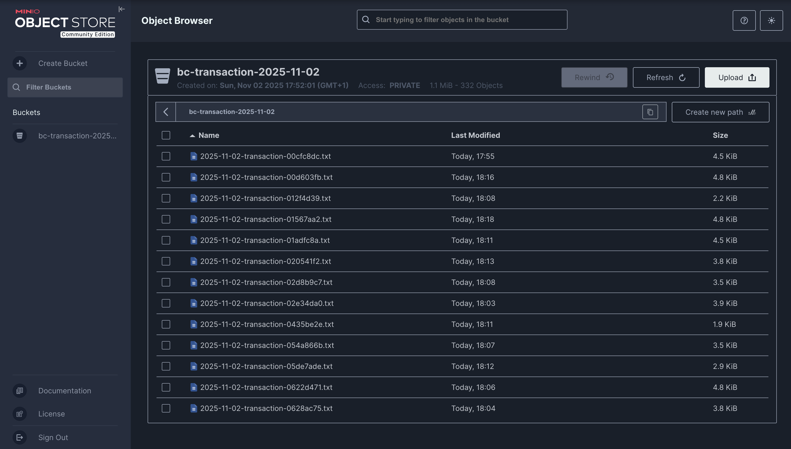

# 🏦 **Bank Pipeline – Kubernetes / Kind**

## 📘 **Présentation**

Ce projet met en place un **pipeline de données temps réel** simulant une **analyse d’opérations bancaires** déployée dans un **cluster Kubernetes (via Kind)**.

L’objectif est de :

* détecter les **transactions suspectes** (provenant d’un paradis fiscal et supérieures à 100 000 $),
* les **enrichir avec un agent de contrôle** (MongoDB),
* puis les **afficher en direct** sur une interface Web.

---

## ⚙️ **Architecture du pipeline**

Le pipeline se compose de plusieurs microservices :

### 🧩 1. **Producer (Python)**

* Génère des transactions bancaires aléatoires.
* Publie les messages dans **Kafka** (via **Redpanda**).

### 🔥 2. **Spark App (PySpark)**

* Consomme les transactions Kafka.
* Vérifie si :

  * 💰 le montant > 100 000 $
  * 🏝️ le pays du créditeur figure dans la table `tax_havens` (PostgreSQL)
* Si suspect → affecte un agent (MongoDB) et enregistre dans **MySQL**.
* sinon ⇒ écrit des fichiers **.txt** par tranche de 20 dans **MinIO** (bucket journalier `bc-transaction-<date>`).

### 🌐 3. **Web App (Node.js)**

* Affiche les transactions suspectes en **temps réel (SSE)**.
* Les données sont extraites de **MySQL**.

---

## ☸️ **Déploiement Kubernetes (Kind)**

L’ensemble du pipeline tourne sur un cluster **Kind (Kubernetes IN Docker)** à **3 nœuds** :

* 1 Control-plane (master)
* 2 Workers

Le fichier [`config/kind-config.yaml`](./config/kind-config.yaml) définit la topologie du cluster.

> 🧱 Tous les composants (PostgreSQL, MongoDB, MinIO, Redpanda, Producer, Spark, Web) sont déployés via des **manifests Kubernetes** :
> `Deployment`, `Service`, `ConfigMap`, `Secret`, etc.

---

## 🖼️ **Résultats attendus**

### Interface Web – Transactions suspectes

Affichage en temps réel (SSE) depuis MySQL :

---

### Interface MinIO – Buckets journaliers

Transactions non suspectes enregistrées dans des fichiers texte :

---

## 🧩 **Technologies principales**

| Composant               | Technologie                               | Rôle |
| ----------------------- | ----------------------------------------- | ---- |
| 🦅 **Redpanda (Kafka)** | Message broker temps réel                 |      |
| ⚡ **PySpark**           | Traitement et détection des anomalies     |      |
| 🐘 **PostgreSQL**       | Référentiel des paradis fiscaux           |      |
| 🍃 **MongoDB**          | Liste des agents de conformité            |      |
| 🐬 **MySQL**            | Base des transactions suspectes           |      |
| 📦 **MinIO**            | Stockage objet pour transactions normales |      |
| 🌐 **Node.js**          | Interface Web en streaming                |      |
| 🐳 **Kind**             | Cluster Kubernetes local                  |      |
| ☸️ **Kubernetes**       | Orchestration et haute disponibilité      |      |

---

## 🎯 **Objectifs pédagogiques**

* Construire un **pipeline de données distribué et temps réel**.
* Déployer et orchestrer des **microservices hétérogènes**.
* Mettre en œuvre **Kafka + Spark Streaming** dans Kubernetes.
* Comprendre les interactions entre **bases SQL/NoSQL** et stockage objet.
* Développer une approche **DataOps complète** (observabilité, modularité, scalabilité).

---

💡 **En résumé :**

> Ce projet illustre un **pipeline complet de détection de fraude** bancaire,
> entièrement **conteneurisé et orchestré par Kubernetes**,
> exécuté localement grâce à **Kind**.

